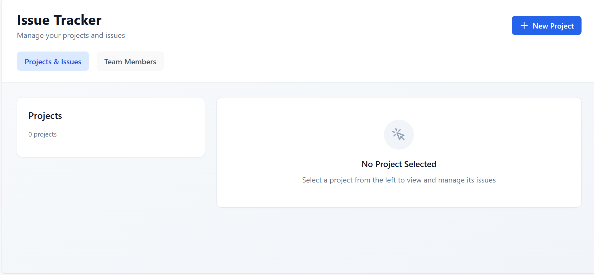
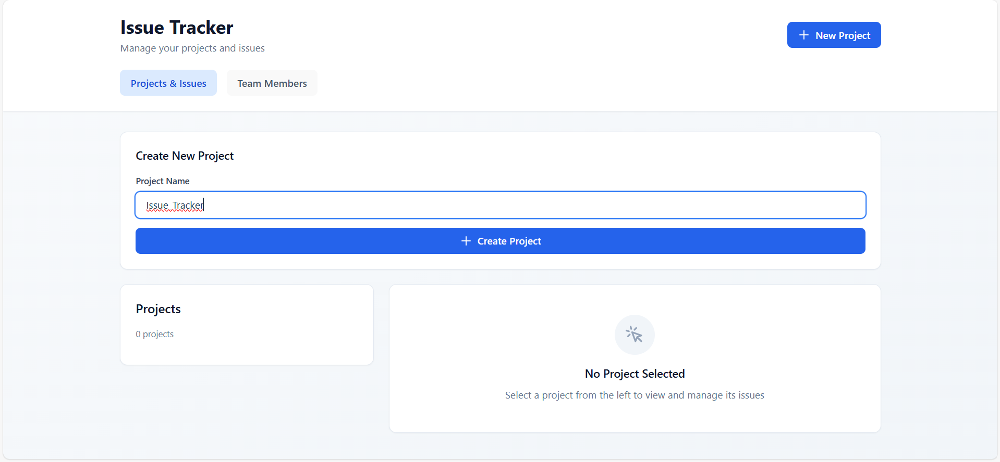
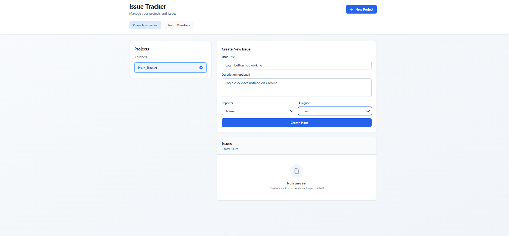
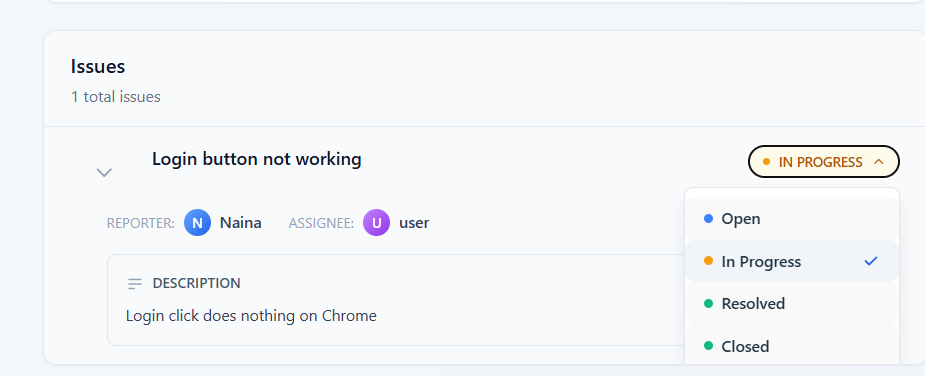
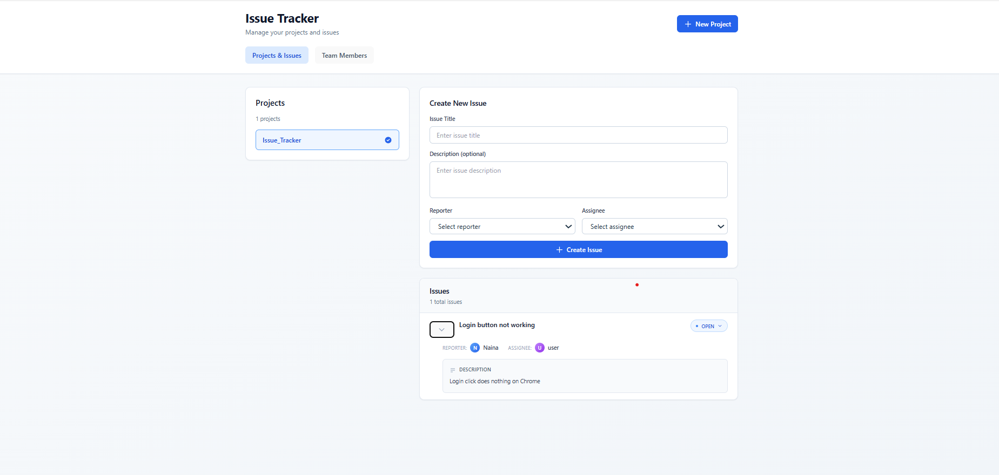

# Issue Tracker

A lightweight project and issue tracking system built with PostgreSQL, Sequelize, Express, and React.

---

## ✨ Features

- Create and manage projects
- Track issues with `OPEN`, `IN_PROGRESS`, and `CLOSED` statuses
- Assign issues to team members
- Auto-seeded demo data for quick testing

---

## 🛠️ Tech Stack

**Backend:** Node.js, Express, Sequelize  
**Database:** PostgreSQL  
**Frontend:** React, Vite, Tailwind CSS

---

## 📸 Screenshots






<p align="center">
  
</p>



---

## 🚀 Quick Start

**1. Clone & Install**
```bash
git clone https://github.com/NainaKothari-14/Issue_Tracker.git
cd Issue_Tracker

cd backend && npm install
cd ../frontend && npm install
```

**2. Setup Database**
```sql
CREATE DATABASE issue_tracker;
```

Create `.env` in `backend` folder:
```env
DB_NAME=issue_tracker
DB_USER=your_username
DB_PASSWORD=your_password
DB_HOST=localhost
```

**3. Run the App**
```bash
# Backend
cd backend && node server.js

# Frontend (new terminal)
cd frontend && npm run dev
```

Open `http://localhost:5173`

---

## 📝 License

MIT License © Naina Kothari
